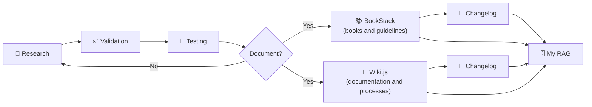
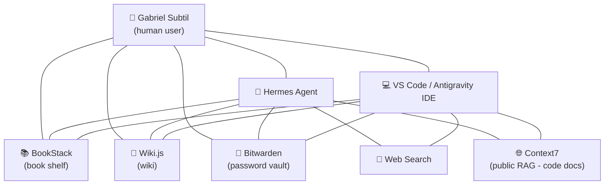

# RAG for Humans

> **This repository is a concept.** An idea, a methodology, a way of thinking — not a finished product. Feel free to use, adapt, and build your own project from it.

> **🌎 American English version.** The original content of this repository is written in Brazilian Portuguese (`README.md` and the `docs/` folder). This is a translation into American English so English-speaking readers can follow along. The Portuguese content remains the primary version and is never changed.

---

## Who I am

My name is **Gabriel Subtil**. I have been working with technology for over **20 years** and, recently, while using **Hermes Agent**, I created a methodology to build **my own RAG system**. The first rule of this concept is simple: **it is not about getting people or tech teams to adapt to a new technology. It is about getting a new technology to adapt to people.**

## The problem: RAG is a broad concept

When we talk about RAG, it ends up being a very broad concept. In Hermes Agent — or even in Codex, or in Antigravity IDE — **any Markdown file, any skill, or even a local database ends up becoming a RAG**.

All of this sounds promising, but **auditing and managing those local files ends up being somewhat complex**. And it is still RAG: **MCP servers**, or even **web search** — after all, the internet ends up being one big RAG for getting information.

I have noticed that people use AI in an **individual** way. I could assume that more than 90% of people in the world are using the new artificial intelligence technologies individually. **What I am building here is a team vision.** I started asking myself how a real AI agent could work inside a team — with one or more automations, with one or more modern intelligence tools. And when you put an AI agent inside a team, there are **processes it needs to respect**. Only part of the team is made of human beings. I cannot assume that everyone on a team is an experienced developer — there are people from sales or marketing, and it is much easier for them to have a Wikipedia-like interface than a SQL one. **That is the sense in which I designed this whole concept that I am presenting to you.**

But still, beyond the company data management issue, I keep wondering how we could, somehow, **put the human being first**. In a world with so much artificial intelligence, with so many AI agents, **little is said about putting the human being on the reins, putting the human being in control**. And that was my intention.

## What is RAG

Before going on, let me explain the starting point. **RAG** stands for **Retrieval-Augmented Generation**. It is a concept that sounds complicated, but it is simple: instead of the AI model answering only with what it "remembers" from training, the system **retrieves** relevant information from an external source — a document, a database, a file — and **injects** that information into the context before generating the answer.

In practice, RAG is the mechanism that gives the model access to knowledge it did not have: up-to-date knowledge, specific to your domain, your company, your project. It is what turns a generic model into an assistant that knows your world.

**And here is the differentiator of what I am proposing.** Most people use RAG in a "technical" way: they build a pipeline, index documents, connect a vector database, and that's it — the model answers better. That is valid, but the focus is on the **machine**: performance, precision, infrastructure.

What I am proposing is different: **putting the human being at the center**. Instead of RAG being just an internal mechanism for the model to answer better, I want RAG to be a **knowledge layer that the human can see, audit, and control**. It is not just "the model retrieves and answers" — it is "the human knows where every piece of information came from, can check it, can manage it, and is in control". RAG stops being a black box and becomes a **living, organized, auditable library** — made for humans, not just for machines.

## The discovery

Almost by accident, because it was truly natural to me, I noticed that I could **transfer exactly the corporate scenario to my Hermes Agent** — which, in fact, ends up becoming a **RAG that I connected to all my platforms**:

- My **OpenCode** has access to my RAG.
- My **Antigravity IDE** has access to my RAG.
- My **Hermes Agent** — on several local servers, or on host servers, or on a VPS — has access to the same service.

What I am about to say is so simple that I considered not even writing this repository. In fact, I would not even know how to share this with you, until, talking to a colleague, I found it interesting and created this repository.

## How it works

So far I consider this project **unique**. I know it is quite common, but I see it as unique because **I combined tools that already exist** — which every IT team in Brazil or abroad has access to — but that people are not giving due value. It is such a simple and obvious connection that at least the IT analysts and IT managers I have been talking to had not even made that connection. Which is normal for a creative mind.

Every IT team today has:

- A **shared folder** on the network.
- A **password vault** — and I hope it is managed by a decent service, such as **Bitwarden**.
- A **self-hosted internal wiki**, such as **Wiki.js**.
- And very few IT teams document something with, for example, **BookStack** — a wonderful project that I recently found almost by chance.

**And that is exactly it.** What I noticed, which few have noticed yet, is that **many of these tools today already have an MCP server, already have API access, and many of them have always supported data feeding through the CLI**. It is no coincidence that we were already using these platforms in some internal automations.

**What I did was extremely simple:** I connected my Hermes Agent to self-hosted servers.

- On my VPS, I have a **BookStack** installed.
- On my VPS, I have a **Wiki.js** installed, which is mine.
- **The management is mine, the audit is mine.** I control who comes in, who goes out, and who reads.

## The process

1. I use **Hermes Agent** (or any similar software, like VS Code) to do **internet research** and **validations**.
2. Everything I research and everything I validate **in practice, inside my environment**, and every time I need to document something, **naturally goes to my RAG**.

So yes, I will use **internet search as RAG**. But after, within several searches, I see something that was validated or that deserves to be kept:

- It **becomes a book inside my BookStack**.
- It **becomes a complete process inside my Wiki.js**.
- Or even a **changelog** — anything I am programming, whether with Hermes Agent or with my VS Code, I already set up an **AI agent to document it**.

**The process in summary:** I research, validate in practice inside my environment, test — and everything worth keeping becomes documentation in my RAG. The documentation lives in **Wiki.js** (processes) or in **BookStack** (books and guidelines), and the **changelog** lives **inside** those tools — as a line of BookStack or Wiki.js, or both. What does not pass validation goes back to research.

## What this project is

This project will serve for us to **document this**. Basically, this project is just to explain this to you and to make a **table of the services I have already tested and that I use** — and many of them I use as a **skill** or even as an **MCP server**.

The big deal and the big differentiator of being — as I named it in the repository — a **RAG for humans** is having the **human user experience first**, having **human visibility first**.

## The diagram of my RAG

To understand it in practice, nothing better than a drawing. This is the diagram of the RAG I use today — and notice: **the human user is at the center of the process**, not at the start. They are the central point, the reason everything exists.

**How to read the diagram:** I (Gabriel) am at the center. I connect directly to my RAGs (BookStack, Wiki.js, Bitwarden) and to my AI tools (Hermes Agent and VS Code). These tools also connect to the same RAGs — so when I ask something to Hermes Agent or VS Code, they search the same knowledge I use. And both Hermes Agent and VS Code do **web search** and use **public RAGs** (like Context7) to have up-to-date code documentation.

## Tools I use

| Project | Purpose | How I use it |
|---|---|---|
| **Bitwarden** | Password vault | Via API |
| **BookStack** | Book shelf | Writing guidelines and project books; inside them I use changelogs |
| **Wiki.js** | Wiki (the crown jewel) | The most complete project, where I found the most things |

## Honorable mentions (not used as RAG)

Other projects may not be on my radar, but the methodology I am offering you can easily be used in an **Excel spreadsheet** that you and your team already used before, or even with **Notion**, which many people use nowadays. I did not adapt much to Notion, by the way — as far as I remember, writing in Notion tables requires another kind of API — but it is a suggestion. As is **Trello**, which I love, which I like.

| Project | Purpose | Why I don't use it as RAG |
|---|---|---|
| **Google Workspace** | Spreadsheets, docs, email | I use it to feed tables, but it is not my main RAG |
| **Notion** | Notes and documentation | I did not adapt much; tables require another kind of API |
| **Trello** | Boards and task management | I love it, but it is not my RAG |
| **Excel** | Spreadsheets | The methodology works on it, but I prefer tools with API/MCP |

## The final lesson

Speaking of Trello, it is one more example of how we have to think about the **user experience**. For each of these tools, we have to think about the **purpose for which they were created** and let that whole **graphical interface make things easier for the human being**.

Today, I can easily **audit and search my projects**, precisely because I am using an **interface made for humans, with separated semantic goals**.

So here is my humble project.

---

## License

This project is distributed under the **MIT** license — the most permissive and public possible. You can use, copy, modify, distribute, and even use it commercially, as long as you keep the copyright notice. It is an open concept: take it, adapt it, and build your own project.
