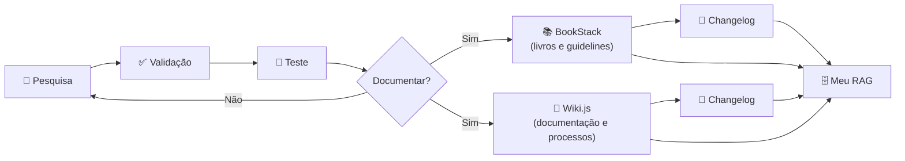
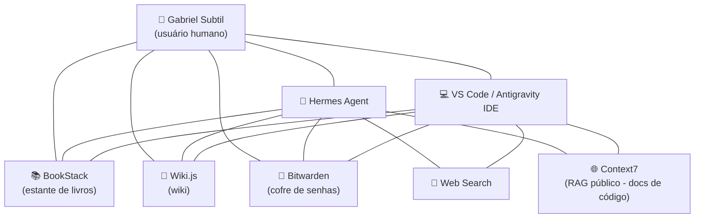

# RAG for Humans

> **Este repositório é um conceito.** Uma ideia, uma metodologia, uma forma de pensar — não um produto pronto. Sinta-se livre para usar, adaptar e construir o seu próprio projeto a partir daqui.

---

## Quem sou eu

Meu nome é **Gabriel Subtil**. Trabalho com tecnologia há mais de **20 anos** e, recentemente, com o uso do **Hermes Agent**, criei uma metodologia para ter o **meu próprio sistema de RAG**. A primeira regra desse conceito é simples: **não é fazer pessoas ou times de tecnologia se adaptarem a uma nova tecnologia. É fazer uma nova tecnologia se adaptar a pessoas.**

## O problema: RAG é um conceito amplo

Quando a gente fala em RAG, é um conceito que acaba sendo muito amplo. No Hermes Agent — ou mesmo no Codex, ou no Antigravity IDE — **qualquer arquivo MD, qualquer skill, ou mesmo um banco de dados local, acaba se tornando um RAG**.

Tudo isso parece promissor, mas **auditar e gerir esses arquivos locais acaba sendo um pouco complexo**. E não deixa de ser RAG também: **servidores MCP**, ou mesmo **busca na web** — afinal, a internet acaba sendo um grande RAG para ter informação.

Tenho notado que as pessoas usam a IA de forma **individual**. Eu poderia pressupor que mais de 90% das pessoas do mundo estão utilizando de forma individual as novas tecnologias com inteligência artificial. **O que eu estou construindo aqui é uma visão de equipe.** Comecei a me perguntar como um agente de IA de verdade poderia trabalhar dentro de uma equipe — com uma ou mais automações, com uma ou mais ferramentas de inteligência moderna. E quando você coloca um agente de IA dentro de uma equipe, tem **processos que ele precisa respeitar**. Só que parte da equipe são seres humanos. Eu não posso pressupor que todos de uma equipe são desenvolvedores experientes — existem pessoas da área comercial ou de marketing, e é muito mais fácil elas terem uma interface de Wikipedia do que de um SQL. **É nesse sentido que eu pensei todo esse conceito que eu apresento a vocês.**

Mas ainda assim, fora a questão de gestão de dados da empresa, eu fico imaginando como a gente poderia, de alguma maneira, **colocar o ser humano em primeiro lugar**. Num mundo com tanta inteligência artificial, com tantos agentes de IA, **pouco se fala em colocar o ser humano na rédea, colocar o ser humano no controle**. E essa foi a minha intenção.

## O que é RAG

Antes de seguir, deixa eu explicar o ponto de partida. **RAG** é a sigla em inglês para **Retrieval-Augmented Generation** — em português, **Geração Aumentada por Recuperação**. É um conceito que parece complicado, mas é simples: em vez de o modelo de IA responder apenas com o que ele "lembra" do treinamento, o sistema **busca** (recupera) informação relevante em uma fonte externa — um documento, uma base de dados, um arquivo — e **injeta** essa informação no contexto antes de gerar a resposta.

Na prática, RAG é o mecanismo que dá ao modelo acesso a conhecimento que ele não tinha: conhecimento atualizado, específico do seu domínio, da sua empresa, do seu projeto. É o que transforma um modelo genérico em um assistente que conhece o seu mundo.

**E aqui está o diferencial do que eu estou propondo.** A maioria das pessoas usa RAG de uma forma "técnica": montam um pipeline, indexam documentos, conectam um banco vetorial, e pronto — o modelo responde melhor. É válido, mas o foco está na **máquina**: na performance, na precisão, na infraestrutura.

O que eu estou propondo é diferente: **colocar o ser humano no centro**. Em vez de RAG ser só um mecanismo interno para o modelo responder melhor, eu quero que RAG seja uma **camada de conhecimento que o humano consegue ver, auditar e controlar**. Não é só "o modelo busca e responde" — é "o humano sabe de onde veio cada informação, consegue conferir, consegue gerir, e está no controle". O RAG deixa de ser uma caixa preta e vira uma **biblioteca viva, organizada e auditável** — feita para humanos, não apenas para máquinas.

## A descoberta

Meio que sem querer, por ser algo realmente natural para mim, eu notei que eu poderia **transferir exatamente o cenário corporativo para o meu Hermes Agent** — que, na verdade, acaba se tornando um **RAG que eu conectei a todas as minhas plataformas**:

- O meu **OpenCode** tem acesso ao meu RAG.
- O meu **Antigravity IDE** tem acesso ao meu RAG.
- O meu **Hermes Agent** — em vários servidores locais, ou em servidores em host, ou em VPS — tem acesso ao mesmo serviço.

É tão simples o que eu vou falar que eu cogitei nem escrever esse repositório. Na verdade, eu nem saberia como compartilhar isso com vocês, até que, conversando com um colega, acabei achando interessante e criei esse repositório.

## Como funciona

Até então eu acho esse projeto **único**. Sei que é bastante comum, mas eu vejo de modo único porque **uni ferramentas que já existem** — que todo time de TI do Brasil ou fora do Brasil tem acesso — mas que as pessoas não estão dando o devido valor. É uma conexão tão simples e tão óbvia que pelo menos os analistas de TI e os gestores de TI com quem eu tenho conversado nem tinham feito essa conexão. O que é normal para uma mente criativa.

Todo time de TI hoje tem:

- Uma **pasta compartilhada** na rede.
- Um **cofre de senhas** — e eu espero que seja gerido por um serviço decente, como por exemplo o **Bitwarden**.
- Um **wiki** auto-hospedado internamente, como por exemplo o **Wiki.js**.
- E pouquíssimos times de TI documentam algo com, por exemplo, o **BookStack** — um projeto maravilhoso que recentemente eu encontrei quase que por acaso.

**E é justamente isso.** O que eu notei, que poucos ainda notaram, é que **muitas dessas ferramentas hoje já têm servidor MCP, já têm acesso por API, e muitas delas também sempre tiveram alimentação de dados por CLI**. Não é à toa que a gente já utilizava essas plataformas em algumas automações internamente.

**O que eu fiz foi extremamente simples:** eu conectei o meu Hermes Agent a servidores auto-hospedados.

- No meu VPS, eu tenho um **BookStack** instalado.
- No meu VPS, eu tenho um **Wiki.js** instalado, que é meu.
- **A gestão é minha, a auditoria é minha.** Eu controlo quem entra, quem sai e quem lê.

## O processo

1. Eu uso o **Hermes Agent** (ou qualquer um desses softwares parecidos, como o VS Code) e faço **pesquisas na internet** e faço **validações**.
2. Tudo aquilo que eu pesquiso e tudo aquilo que eu valido **na prática, dentro do meu ambiente**, e toda vez que eu preciso documentar algo, **naturalmente já vai para o meu RAG**.

Então, sim, eu vou usar **busca na internet como RAG**. Mas depois que, dentro de várias buscas, eu vejo algo que foi validado ou que mereça guardar:

- Aquilo **vira um livro dentro do meu BookStack**.
- Aquilo **vira um processo completo dentro do meu Wiki.js**.
- Ou mesmo um **changelog** — qualquer coisa que eu esteja programando, seja com o Hermes Agent ou mesmo com o meu VS Code, eu já configuro um **agente de IA para documentar aquilo ali**.

**O processo em resumo:** eu pesquiso, valido na prática dentro do meu ambiente, testo — e tudo o que merece ser guardado vira documentação no meu RAG. A documentação fica no **Wiki.js** (processos) ou no **BookStack** (livros e guidelines), e o **changelog** vive **dentro** dessas ferramentas — como uma linha do BookStack ou do Wiki.js, ou dos dois. O que não passa na validação, volta para a pesquisa.

## O que este projeto é

Este projeto vai servir para a gente **documentar isso**. Basicamente, este projeto é só para explicar isso para vocês e fazer uma **tabela dos serviços que eu já testei e que eu uso** — e muitos deles eu uso como **skill** ou mesmo como **servidor MCP**.

O grande lance e o grande diferencial de ser — como eu nomeei no repositório — um **RAG para humanos** é ter a **experiência de um usuário humano em primeiro lugar**, ter uma **visibilidade humana em primeiro lugar**.

## O diagrama do meu RAG

Para entender na prática, nada melhor que um desenho. Este é o diagrama do RAG que eu uso hoje — e repare: **o usuário humano está ao centro do processo**, não no início. Ele é o ponto central, a razão de tudo existir.

**Como ler o diagrama:** eu (Gabriel) estou no centro. Me conecto diretamente aos meus RAGs (BookStack, Wiki.js, Bitwarden) e às minhas ferramentas de IA (Hermes Agent e VS Code). Essas ferramentas também se conectam aos mesmos RAGs — então, quando eu peço algo ao Hermes Agent ou ao VS Code, eles buscam no mesmo conhecimento que eu uso. E tanto o Hermes Agent quanto o VS Code fazem **web search** e usam **RAGs públicos** (como o Context7) para ter documentação atualizada de código.

## Ferramentas que eu uso

| Projeto | Para quê | Como eu utilizo |
|---|---|---|
| **Bitwarden** | Cofre de senhas | Via API |
| **BookStack** | Estante de livros | Escrever guidelines e livros de projetos; dentro deles uso changelog |
| **Wiki.js** | Wiki (a joia da coroa) | O projeto mais completo, onde mais encontrei coisas |

## Menções honrosas (não uso como RAG)

Outros projetos podem não estar no meu radar, mas a metodologia que eu estou oferecendo a vocês facilmente vocês podem utilizar numa **planilha de Excel** que você e o seu time já utilizavam antes, ou mesmo com **Notion**, que muitas pessoas utilizam hoje em dia. Não me adaptei muito ao Notion, inclusive — salvo engano, para escrever em tabelas de Notion precisa ter outro tipo de API — mas fica a sugestão. Como também o **Trello**, que eu adoro, que eu gosto.

| Projeto | Para quê | Por que não uso como RAG |
|---|---|---|
| **Google Workspace** | Planilhas, docs, e-mail | Uso para alimentar tabelas, mas não é meu RAG principal |
| **Notion** | Notas e documentação | Não me adaptei muito; para tabelas precisa de outro tipo de API |
| **Trello** | Quadros e gestão de tarefas | Adoro, mas não é meu RAG |
| **Excel** | Planilhas | Metodologia funciona nele, mas prefiro ferramentas com API/MCP |

## A lição final

Falando do Trello, é mais um exemplo de como a gente tem que pensar para a **experiência do usuário**. Para cada uma dessas ferramentas, a gente tem que pensar no **objetivo para o qual elas foram criadas** e deixar toda essa **interface gráfica do ser humano facilitar**.

Hoje, facilmente, eu consigo **auditar e buscar os meus projetos**, justamente porque eu estou utilizando **interface feita para humanos, com objetivos semânticos separados**.

Então, fica aqui meu humilde projeto.

---

## Licença

Este projeto é distribuído sob a licença **MIT** — a mais permissiva e pública possível. Você pode usar, copiar, modificar, distribuir e até usar comercialmente, desde que mantenha o aviso de copyright. É um conceito aberto: leve, adapte e construa o seu próprio projeto.
