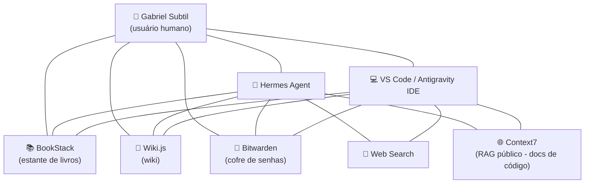

## O diagrama do meu RAG

Para entender na prática, nada melhor que um desenho. Este é o diagrama do RAG que eu uso hoje — e repare: **o usuário humano está ao centro do processo**, não no início. Ele é o ponto central, a razão de tudo existir.

**Como ler o diagrama:** eu (Gabriel) estou no centro. Me conecto diretamente aos meus RAGs (BookStack, Wiki.js, Bitwarden) e às minhas ferramentas de IA (Hermes Agent e VS Code). Essas ferramentas também se conectam aos mesmos RAGs — então, quando eu peço algo ao Hermes Agent ou ao VS Code, eles buscam no mesmo conhecimento que eu uso. E tanto o Hermes Agent quanto o VS Code fazem **web search** e usam **RAGs públicos** (como o Context7) para ter documentação atualizada de código.

## RAGs públicos (sugestão)

Nem todo RAG precisa ser seu. Muitos conhecimentos já existem em repositórios públicos — não faz sentido todo time de TI manter um banco de dados de manual de todos os códigos quando existe um repositório público. Aqui está uma tabela de RAGs públicos que você pode usar:

| RAG público | Intenção | Como eu utilizo |
|---|---|---|
| **Context7** | Documentação atualizada de código | Via MCP (quem tem acesso: meu VS Code e meu Hermes Agent) |
