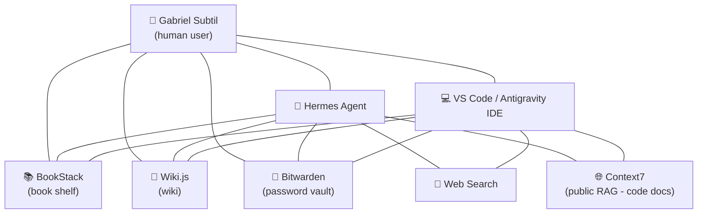

## The diagram of my RAG

To understand it in practice, nothing better than a drawing. This is the diagram of the RAG I use today — and notice: **the human user is at the center of the process**, not at the start. They are the central point, the reason everything exists.

**How to read the diagram:** I (Gabriel) am at the center. I connect directly to my RAGs (BookStack, Wiki.js, Bitwarden) and to my AI tools (Hermes Agent and VS Code). These tools also connect to the same RAGs — so when I ask something to Hermes Agent or VS Code, they search the same knowledge I use. And both Hermes Agent and VS Code do **web search** and use **public RAGs** (like Context7) to have up-to-date code documentation.

## Public RAGs (suggestion)

Not every RAG needs to be yours. A lot of knowledge already exists in public repositories — it makes no sense for every IT team to maintain a database with manuals for every piece of code when a public repository exists. Here is a table of public RAGs you can use:

| Public RAG | Intention | How I use it |
|---|---|---|
| **Context7** | Up-to-date code documentation | Via MCP (who has access: my VS Code and my Hermes Agent) |
